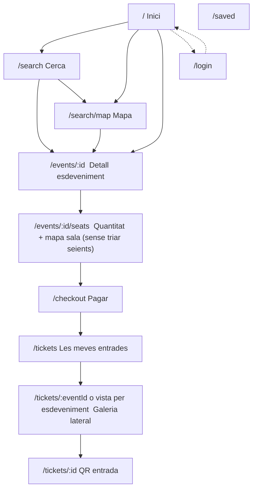

# Plataforma nacional d’esdeveniments (Espanya)

Document viu: **estat actual**, **objectiu de producte**, **flux de pantalles** (amb pantalles noves), **filtres**, **sincronització Ticketmaster**, **dades persistides** i **forats respecte el que volem** (revisió sobre el repo).

**Context actual (ja incorporat al projecte):**

- API de **Google Maps** per contextualitzar ubicacions i mapes.
- Filtratge per **proximitat** (només esdeveniments propers al radi de l’usuari) en alguns fluxos — **l’objectiu és canviar el comportament per defecte** (vege §Objectiu).
- **Gemini** (Google) per recomanacions o contingut relacionat amb les entrades de l’usuari (feed / relacions).

---

## Objectiu de producte (el que volem ara)

1. **Catàleg per defecte = tota Espanya**, no només el radi de l’usuari. L’usuari ha de veure **primer** esdeveniments d’**entrades / música / festa / grans esdeveniments**, **no** museus ni oferta cultural genèrica fora d’aquest enfoc (el filtratge per tipus ho acota — vege §Categories i sync).
2. **Sincronització Ticketmaster**: avui la base només reflecteix un subconjunt (p. ex. ~200 esdeveniments propers a la crida). Volem **pujar i guardar tots els esdeveniments d’Espanya** que encaixin amb els nostres filtres de categoria, amb **paginació completa** i emmagatzematge com ja es fa, però **sense limitar-se al “propers”** com a únic criteri de captura.
3. **Proximitat = opt-in**: un **botó a la part superior de la pàgina d’inici** activa el filtre per distància; **no afecta la pàgina Cerca**. En sortir d’inici i tornar-hi, el filtre es **desactiva / es buida**; amb **refresh** de la pàgina, el filtre **es manté** (p. ex. `localStorage`). Quan està actiu, l’usuari tria **km** i l’API filtra per distància.
4. **Mapa**: mostra **el 100% dels esdeveniments d’Espanya** (marcadors). Els filtres (dates, text, ciutat, categories, etc.) **redueixen el conjunt** al mapa igual que a la llista.
5. **Filtres unificats** entre llista i mapa: tots els criteris es respecten entre ells (AND lògic on escaigui).

---

## Categories (filtres principals)

Filtres desitjats (etiquetes / segments):

- `party`, `dj`, `social`, `comedy`, `film`, `theatre`, `art`, `sport`, `talk`, `concerts`

Aquests filtres han de poder combinar-se amb la resta (data, ubicació, text).

---

## Filtres detallats (comportament)

| Filtre | Comportament |
|--------|----------------|
| **Dia** | Calendari tipus “un dia”; es mostren tots els esdeveniments d’**aquest dia** respectant la resta de filtres. |
| **Ubicació (dropdown + cerca)** | Com ara amb “Ma…”, suggereix ciutats o ubicacions rellevants en format text (p. ex. `Madrid, Madrid, Spain`, `Madridejos, Toledo, Spain`). En triar-ne una, es filtren **esdeveniments i mapa**. Les ubicacions són **només text** (no cal widget Google Places si el flux intern + dades ho cobreixen). |
| **Data + ubicació + nom + categories** | Tots es combinen; el mapa reflecteix el mateix subconjunt que la llista. |

---

## Dades Ticketmaster (persistència)

Per als esdeveniments que **entrin dins els filtres de categoria** que mantenim al catàleg, volem **guardar-ho tot el que exposi l’API** (o el màxim raonable en model): entre altres **preu**, **URL** (enllaç extern / ticketing), metadades de venue, horaris, imatges, classificació, etc. La resta d’esdeveniments fora d’aquestes categories **no** cal sincronitzar-los com a focus del producte.

---

## 1. Flux de navegació (usuari) — flux i pantalles noves

**Notes de flux:**

- **Inici**: per defecte **tota Espanya** + categories; botó superior **“Propers”** (o similar) activa filtre per **km** (només inici; **no** altera Cerca en sortir).
- **Clic a un esdeveniment** → **detall** (`/events/:id`) amb guardar, info, hora, adreça, mapa amb **punt groc**, modal de mapa més gran, enllaç “Obrir a Google Maps”.
- **Get Tickets** (footer del detall) → pantalla amb **mapa de la sala** + **quantitat** (input `number`, màx. 6, sense dropdown) + total que s’actualitza; **sense elecció de seients** en aquesta fase del projecte.
- **Comprar** → checkout → entrades associades a l’esdeveniment; a **Les meves entrades**, vista amb **deslitzament lateral** de tiquets, info de l’esdeveniment, footer amb **enrere** i **hora**.

---

## 2. Pantalla per pantalla: ruta i contingut (objectiu)

| Ruta | Què ha de mostrar |
|------|-------------------|
| **`/`** (`pages/index.vue`) | Llista **de tota Espanya** (categories acotades). **Botó superior** per activar **filtre per proximitat** (km configurable); en navegar fora i tornar, filtre **off**; amb **F5**, filtre **persistit**. Sense proximitat: catàleg complet (o segons filtres globals). Amb proximitat: crida API que filtra per distància. |
| **`/search`** | Formulari amb **categories** (party, dj, …), **calendari de dia**, **ubicació** (dropdown amb suggeriments tipus “Ma…” → ciutats text), **text** opcional. **No** hereta automàticament el filtre de proximitat d’inici. |
| **`/search/map`** | Mapa amb **tots** els esdeveniments d’Espanya com a base; amb filtres actius, només els que compleixin (mateix conjunt que la cerca). |
| **`/events/:eventId`** (**nova**) | Detall: **Guardar**, informació, **hora d’inici**, ubicació exacta; **Google Maps** amb **marcador groc**; clic → **modal** (no pantalla completa) amb mapa més gran, adreça exacta, botó **Open Google Maps** (URL amb carrer cercada). **Footer fix**: preu per entrada a l’esquerra; **Get Tickets** a la dreta. |
| **`/events/:eventId/seats`** | Mapa de sala (snapshot) + **input nombre** de tiquets (1–6), sense dropdown; mostra **total** en viu; **Comprar** → checkout. **Sense** selecció de seients individuals (fase actual). |
| **`/checkout`** | Flux de pagament real (substituir placeholder quan toqui). |
| **`/tickets`** | Per esdeveniment: **deslitzament lateral** de tiquets; sota, **informació de l’esdeveniment**; **footer**: botó **enrere** + **hora** de l’esdeveniment al costat. |
| **`/tickets/:ticketId`** | QR / detall d’una entrada. |

---

## 3. APIs i backend (referència)

Endpoints existents o a ampliar segons disseny: cerca (`/api/search/events`, etc.), **nearby** només quan el filtre de proximitat estigui actiu a inici, comandes (`POST /api/orders`, `POST /api/orders/quantity`), `saved-events`, `tickets`, sync Ticketmaster.

Cal **assegurar**:

- Model i sync amb **camp de preu**, **URL** i **payload complet** Ticketmaster per esdeveniments del catàleg filtrat.
- Endpoint públic de **resum d’esdeveniment** `GET /api/events/{id}` (descripció, preu, venue, hora) per al detall — si encara no existeix a `routes/api.php`, **afegir-lo**.

---

## 4. Forats / treball pendent (respecte aquest pla)

Verificació sobre el codi actual vs aquest document:

1. **Catàleg per defecte**: avui es percep com a **radi / propers**; cal **invertir el predeterminat** (tota Espanya) i deixar **proximitat només amb botó a inici**.
2. **Ticketmaster**: limitació de pàgines / subconjunt “propers”; cal **sync complet ES** amb categories i **sense truncar** a ~200 si l’objectiu és catàleg nacional.
3. **Filtres** (party, dj, …, calendar, ciutat text): cal **implementar o unificar** a Cerca + Mapa amb la mateixa query.
4. **Independència inici / cerca** per al filtre de proximitat + **reset en tornar** vs **persistència en refresh**.
5. **Pàgina de detall** `pages/events/[eventId]/index.vue`: **crear** amb footer preu | Get Tickets, mapa groc, modal, Google Maps link.
6. **`POST /api/orders/quantity` + UI**: vincular input 1–6 i total al flux **sense seients**.
7. **`/checkout`**: deixar de ser només placeholder quan el flux de pagament estigui definit.
8. **`/tickets`**: adaptar a **scroll / swipe horitzontal** de tiquets + footer hora + enrere.
9. **Preu**: deixar de dependre de stubs (`stub_unit_price`) i usar dades persistides de Ticketmaster / esdeveniment.
10. **`SearchEventsController`**: `map_lat` / `map_lng` reals des de PostGIS per al mapa i llistes.

---

*Última actualització: alineació amb el flux desitjat (inici + cerca + mapa + detall + quantitat + tickets).*
